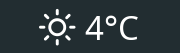

<p align="center">
    </img>
</p>

# wedder

Wedder displays the current weather condition and temperature in a configurable format for status bars like [polybar](https://github.com/jaagr/polybar).
The current weather is pulled from [OpenWeatherMap](https://openweathermap.org/) and you can either set a location manually or let it be determined by your IP.

## Installation

### AUR package

Install the [AUR package](https://aur.archlinux.org/packages/wedder-git/) with your package manager of choice.

### Compile from source

Compile the source code:

> `make`

and place the executable in your path.

Note: [Cargo](https://github.com/rust-lang/cargo/) is required for building.

## Configuration

Because the OpenWeatherMap API is restricted, you have to get an API key by [creating a free account](https://home.openweathermap.org/users/sign_up).
After the API key is activated you can then pass it to wedder using

```bash
wedder --weather-api-key <weather_api_key>
```

For more info use

```bash
wedder --help
```

You can also provide the API key via config file.
An example config is located [here](example/wedder.toml).
The default path wedder expects for the config file can be viewed using

```bash
wedder -p
```

All config options except the weather condition icons can be overriden by passing CLI options.
The weather condition icons can only be set via config file.

### Polybar

Add a custom script module to your polybar config as shown in the [example snippet](example/polybar).

### Fonts

The example config uses [Nerd Fonts](https://github.com/ryanoasis/nerd-fonts) to display the weather icons.
You can install the complete Nerd Fonts package but I wouldn't recommend it, as it is multiple GBs in size.
A better option is to pick a single font like [Noto Sans](https://github.com/ryanoasis/nerd-fonts/blob/master/patched-fonts/Noto/Sans/complete/Noto%20Sans%20Regular%20Nerd%20Font%20Complete.ttf) and install it manually.
For Linux this means placing the `.ttf` file in `/usr/share/fonts/TTF`.

Another option is using the [Weather Icons font](https://github.com/erikflowers/weather-icons) which is also included in Nerd Fonts.
If you are using other fonts however like [Font Awesome](https://github.com/FortAwesome/Font-Awesome) there will most likely be conflicts.

## Technologies

### OpenWeatherMap

To use the OpenWeatherMap API it is required to create a [free account](https://home.openweathermap.org/users/sign_up).
The free account allows a maximum of 60 API calls per minute.

### IP-API

The [IP-API](http://ip-api.com/) service used for geolocation is free to use and does not require an account.
It allows a maximum of 150 API calls per minute.
